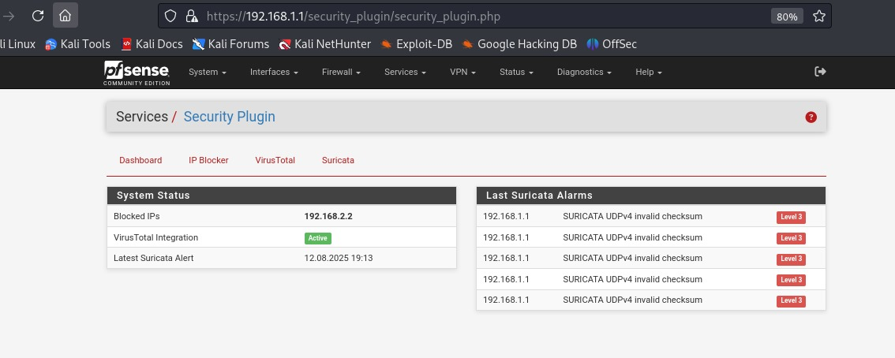
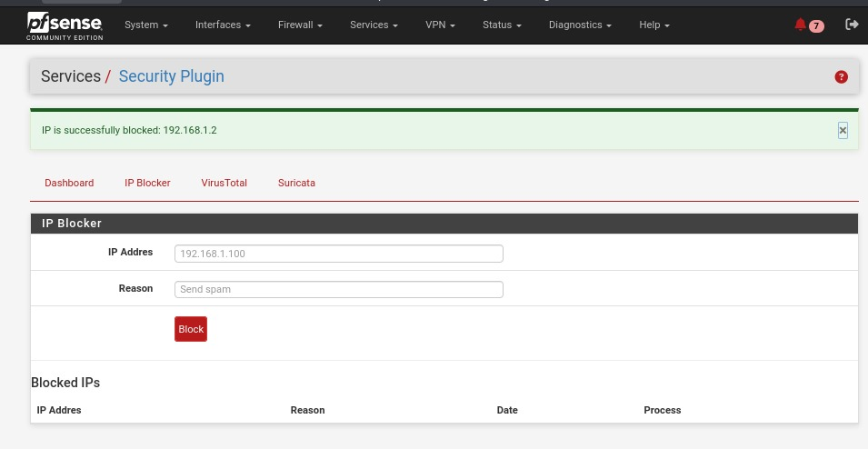
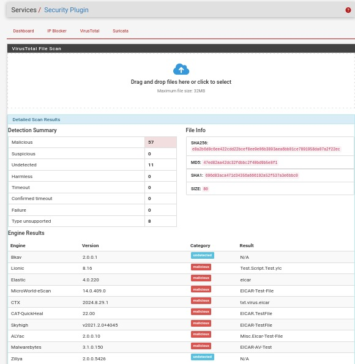
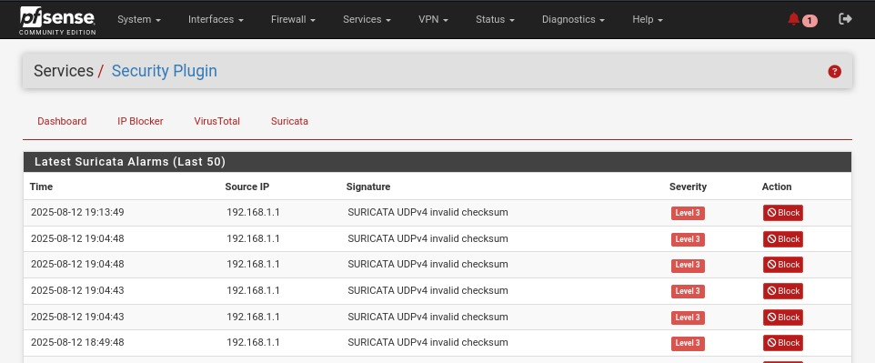

# pfSense Security Plugin

This plugin integrates IP blocking, Suricata log analysis, and VirusTotal scanning for the pfSense firewall.

---

## Features
- Block suspicious IPs automatically  
- Analyze Suricata logs for threats  
- Scan files and URLs via VirusTotal API  

---

## User Interface Preview

Below are screenshots from the pfSense Security Plugin interface:

| Dashboard | IP Blocker | VirusTotal |
|------------|-------------|-------------|------|
|  |  |  |

### Suricata Logs

